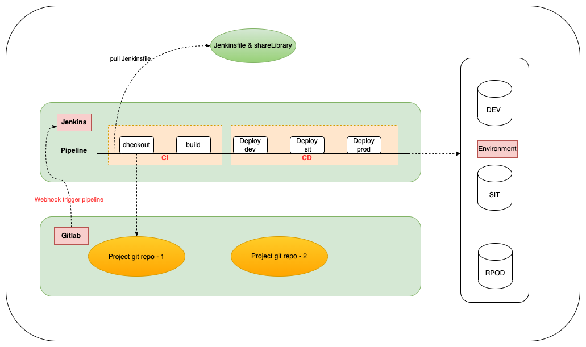
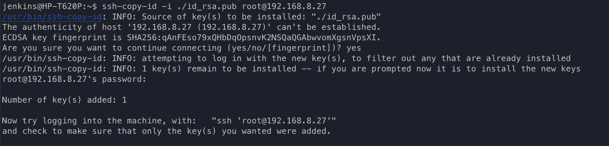
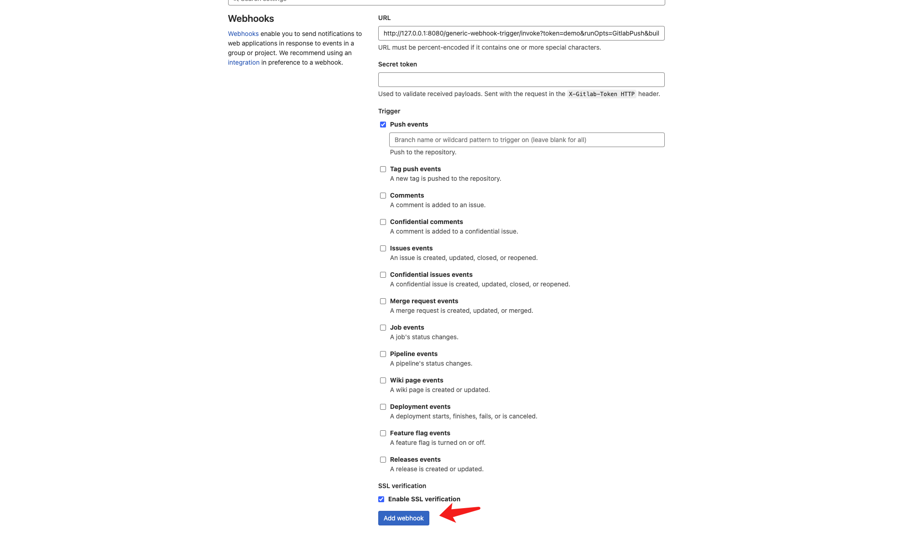

[说明](#说明)

- [运行模式](#运行模式)

[准备工作](#准备工作)

- [插件安装](#插件安装)
- [认证配置](#认证配置)
- [Sharelibrary](#sharelibrary)

[使用](#使用)

- [创建 Pipeline 接入](#创建-pipeline-接入)
- [配置 WebHook 接入](#配置-webhook-接入)

---

# 说明
>  基于 `Jenkins` 提供前后端，端至端 CI/CD 支持，设计此工程时遵循如下规范:
>
>  - 代码分支管理模式 基于 Gitlab `分支发布` 模式，主要分支如下 `dev、sit、uat、prod`
>  - Pipeline 运行基于 `Jenkinsfile Pipeline as Code` 模式
>  - Jenkinsfile 管理模式 与 代码仓库分离，进行解耦管理
>  - 编写 Jenkinsfile 文件时，尽量依赖与原生插件
>
>  **此工程代码 及下述相关插件 实测在  [Jenkins 2.346.3](https://www.jenkins.io/)  版本可正常使用**
---
## 运行模式



**Webhook pipeline 触发流程说明**

1. 开发人员对 `repo -1` 仓库对应分支提交代码更新。
2. Gitlab 收到代码提交后，发送 `Webhook` 通知 Jenkins 运行 pipeline，Webhook 携带当前仓库的相关 info body。
3. 对应 Jenkins pipeline 解析 body ，更具 body 拿到关键字段，检出代码、运行代码编译。
4. 编译通过后，更具解析的关键字段，将对应工程代码部署至目标服务器。

---
# 准备工作

> 此仓库中依赖部分第三方插件需要进行安装，下面插件安装部分，插件列表包含了部分 `提升用户体验` 的插件，更具实际使用场景 `选择性`安装。考虑目前使用环境为 `离线环境` 下，将为下述 `必须安装插件` 提供离线包，存放至此工程的 `plugins` 目录下。

---
## 插件安装

**此工程必须安装插件**

1. [Nodejs](https://plugins.jenkins.io/nodejs/)
2. [Git Parameter](https://plugins.jenkins.io/git-parameter)
3. [Generic Webhook Trigger](https://plugins.jenkins.io/generic-webhook-trigger)
4. [Build user vars](https://plugins.jenkins.io/build-user-vars-plugin)

**提升用户体验插件**

1. [Rebuilder](https://plugins.jenkins.io/rebuild)
2. [Blue Ocean](https://plugins.jenkins.io/blueocean)
3. [Locale plugin](https://plugins.jenkins.io/locale)
4. [Timestamper](https://plugins.jenkins.io/timestamper)

---
## 认证配置

> 针对 Jenkins 实例添加 Credentials，提供后续 pipeline 中进行引用，添加方法: 
>
> - `Manage Jenkins => Manage Credentials =>  Add Credentials`
> - URL 地址: http://JENKINS_URL/credentials/store/system/domain/_/ (替换 JENKINS_URL)

1. 添加对应 Git 仓库 认证

   > 注意对应 Credential ID 需要与 pipeline 中指定所对应

2. SSH 密钥生成

   > 做此操作目的，主要为 CD 部分，方便 ssh 至目标服务器做相关 `指令操作`。使用方法，示例 pipeline 中有示例 (注意：`ID对应`)。

   ```bash
   ssh-keygen -b 2048 -t rsa -f ./id_rsa -q -N "" # 生成公私钥
   
   ssh-copy-id -i ./id_rsa.pub root@xxxx. # 将生成公钥 上传至目标服务器，实现免密钥登录。
   ```
   
   
---
## Sharelibrary

> 将此工程初始化 push 至 Git 仓库中，同时需要在 Jenkins 实例将此 Git 工程地址 添加至 Sharelibrary 库，方法如下:
>
> - `Manage Jenkins => Configure System => Global Pipeline Libraries`
>
> 添加后注意 Library Name 是否与当前 pipeline 工程引用一致。

---
# 使用

> 基于此工程 jenkinsfiles 下提供的，两个示例文件 (一个前端、一个后端)，copy 对应工程类型的示例文件为  `目标工程名称.Jenkinfile`，同样放置在 jenkinsfiles 目录下，工程 ` Jenkinsfile` 统一放置至 `此工程下进行管理`。Copy 过后需要更改的几处地方:
>
> - 20 行: `srcUrl`: 目标工程 Git 仓库地址 
> - 21 行: `buildType`: 目标工程，工程类型目前支持 (`npm` or `mvn`)
> - `buildShell`: 检查 build shell 是否与当前工程 构建 匹配 

---
## 创建 Pipeline 接入

1. New item

2. 输入工程名称，选择 pipeline 模式风格的 创建

3. 拉到 pipeline 最下面 `Pipeline`  端

4. 切换 `pipeline script form SCM`

5. 添加此工程 仓库地址，分支选择 `master`

6. `Script Path` 处填写 jenkinsfiles/xxx.Jenkinsfile （上面所述的目标工程名称）

   

**添加后，`需要手动运行一次` pipeline 做初始化动作，第一次失败 `属于正常`**

后续手动再次运行 Pipeline 时，会已此工程上的分支做 `参数化构建`

---
## 配置 WebHook 接入

> 手动运行一次 pipeline 工程后，对应工程为自动生成 Webhook 监听器，由 `Generic Webhook Trigger` 插件完成。监听地址示例如下:
>
> - http://JENKINS_URL/generic-webhook-trigger/invoke?token=JOB_NAME&runOpts=GitlabPush&buildType=mvn
>
> 上述地址需要更具实际使用情况进行替换说明:
>
> - JENKINS_URL: Jenkins 实例地址 (注意前面的 http 协议是否一致)
> - JOB_NAME: 目标 pipeline 工程的名称
> - buildType: 目标 pipeline 工程构建类型
>
> 示例:  jenkins 地址为 127.0.0.1:8080，pipeline 工程 demo，pipeline 工程构建类型为: mvn，合并地址则如下所示:
>
> - http://127.0.0.1:8080/generic-webhook-trigger/invoke?token=demo&runOpts=GitlabPush&buildType=mvn

---
更具上述说明，拿到 Jenkins webhook 监听器地址后，到对应 Gitlab 工程下添加 Webhook：

- `Settings => Webhooks => URL (贴上上述地址) => 勾选 Push events (事件进行触发)`

  > 更具情况，勾选 SSL 支持


